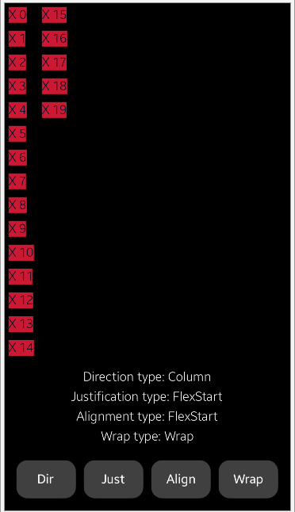
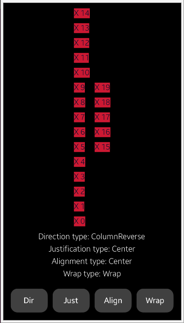

# NUIFlexView
NUIFlexView is a simple app that shows basic [NUI Flex Layout](https://docs.tizen.org/application/dotnet/guides/nui/flex-layout/) usage.

### Fetures
* Press different buttons to see different layout options

### Author
Mateusz Palkowski