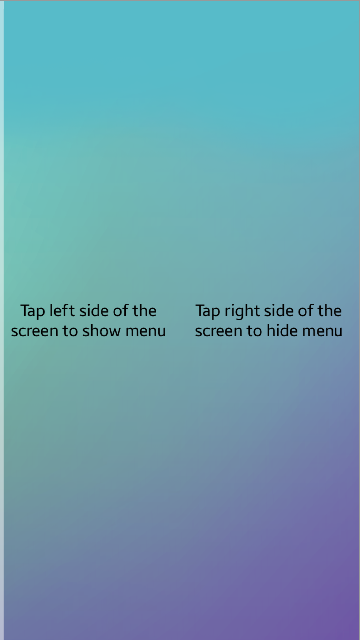
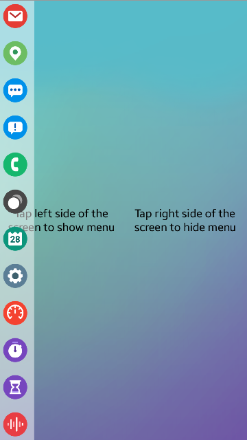

# NUI_Layer

**This sample application demonstrates how to use NUI Layer component.**

A layer is a component that allows you to arrange widgets into overlapping layers. Layer can be used to implement custom menus, popups, floating buttons and other similar widgets. In this example Layer was used to implement menu of icons on left side of the screen. Menu changes its position on left / right side of the screen click action. 

Hidden menu                      |              Visible Menu
:-------------------------------:|:---------------------------------:
 | 

### Description
* To show menu left side of the screen should be clicked. 
* To hide menu right side of the screen should be clicked

### Prerequisites

* [Visual Studio](https://www.visualstudio.com/) - Buildtool, IDE
* [Visual Studio Tools for Tizen](https://docs.tizen.org/application/vstools/install) - Visual Studio plugin for Tizen .NET application development
