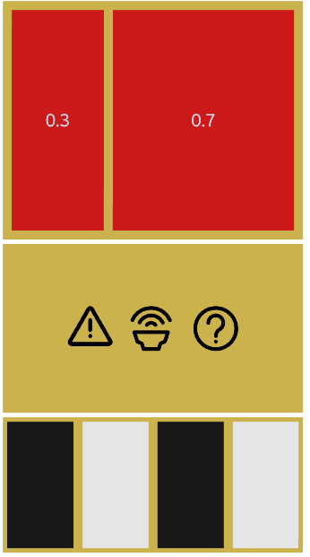

### NUILinearLayout
NUILinearLayout is a siplme app that shows how [NUI Linear Layout](https://docs.tizen.org/application/dotnet/guides/nui/linear-layout/) sample layouts.

### Author
* Mateusz Palkowski