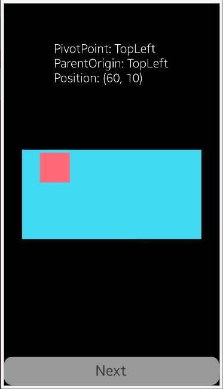
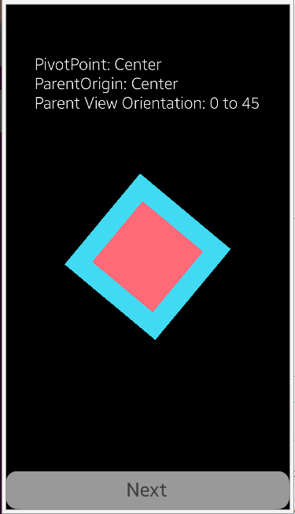

# NUIView
NUIView is a very simple app written to show the basic [NUI View](https://docs.tizen.org/application/dotnet/guides/nui/view/) functionality.

### Features
* Screens with different View configuration examples

### Author
* Mateusz Palkowski

This sample works for Tizen.NET.API9 version 9.0.0.16813 or higher.
