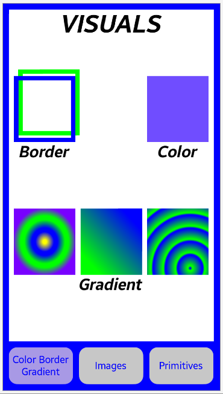
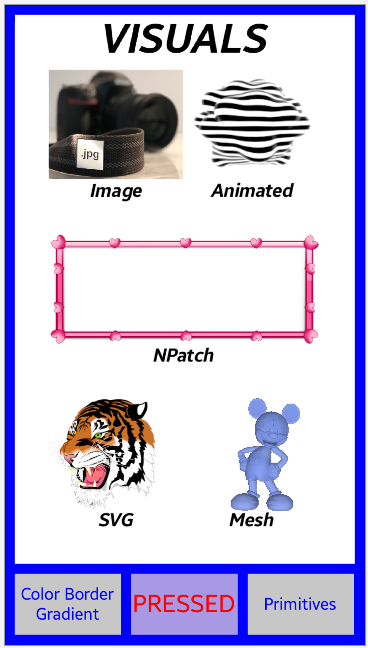
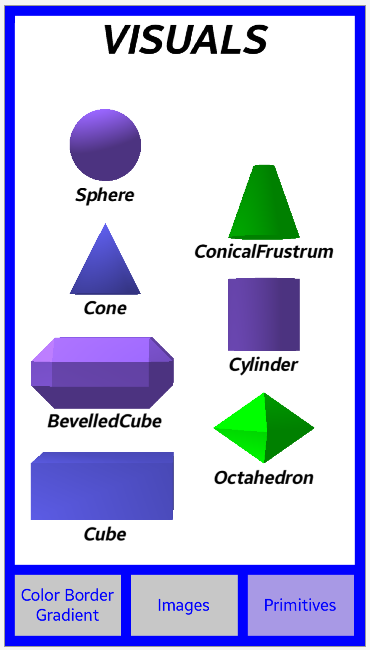

# NUI_Visuals

**This sample application demonstrates how to create NUI visuals.**

Visuals are the main building blocks for UI components, which provide reusable rendering logic.
NUI provides few types of visuals like the `BorderVisual`, `ImageVisual` or `TextVisual`.
The properties specific to each individual visual are encapsulated in the corresponding class such as a 'Border' visual
is defined in a `BorderVisual` class, a 'Color' visual in a `ColorVisual` class, and so on.
The properties that are common for all visual types are inherited from a `VisualMap` class.
To render a visual it has to be added to a control. A container class that controls visuals is a `VisualView`.

In the sample application usage of all the above is presented with their main properties.

The application consists of one big view (`VisualView` class), which is scrolled
after the corresponding button is pressed.
The screenshots of the app are presented below:

 |

For more information about visuals see the [NUI guide](https://docs.tizen.org/application/dotnet/guides/nui/visuals/).
