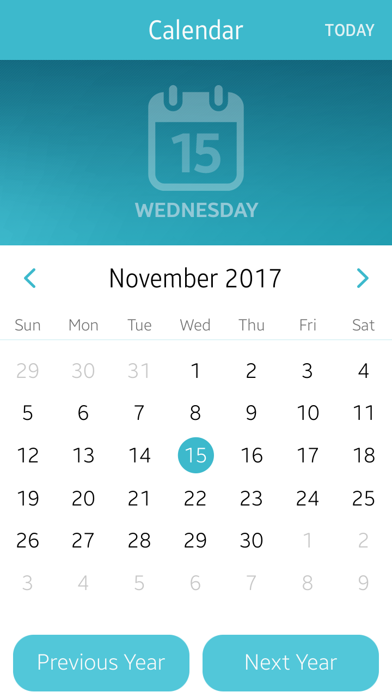

# CalendarComponent
This sample application demonstrates how to implement a calendar.

### Features
* Calendar component with additional navigation.

### Prerequisites

* [Visual Studio](https://www.visualstudio.com/) - Buildtool, IDE
* [Visual Studio Tools for Tizen](https://docs.tizen.org/application/vstools/install) - Visual Studio plugin for Tizen .NET application development

### Author
* Patryk Falba
