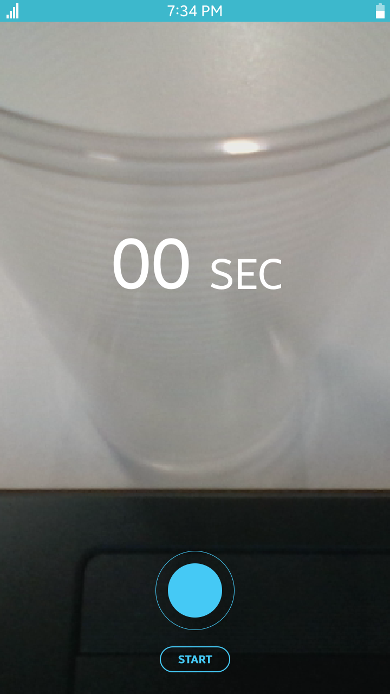

# Camera
Camera is a sample application that demonstrates how to how to take a picture using [Tizen Multimedia API](https://developer.tizen.org/dev-guide/csapi/api/Tizen.Multimedia.html).

### Features
* Taking pictures
* Displaying preview

### Prerequisites
* [Visual Studio](https://www.visualstudio.com/) - Buildtool, IDE
* [Visual Studio Tools for Tizen](https://developer.tizen.org/development/tizen-.net-preview/visual-studio-tools-tizen) - Visual Studio plugin for Tizen .NET application development

### Author
* Mateusz Szperna