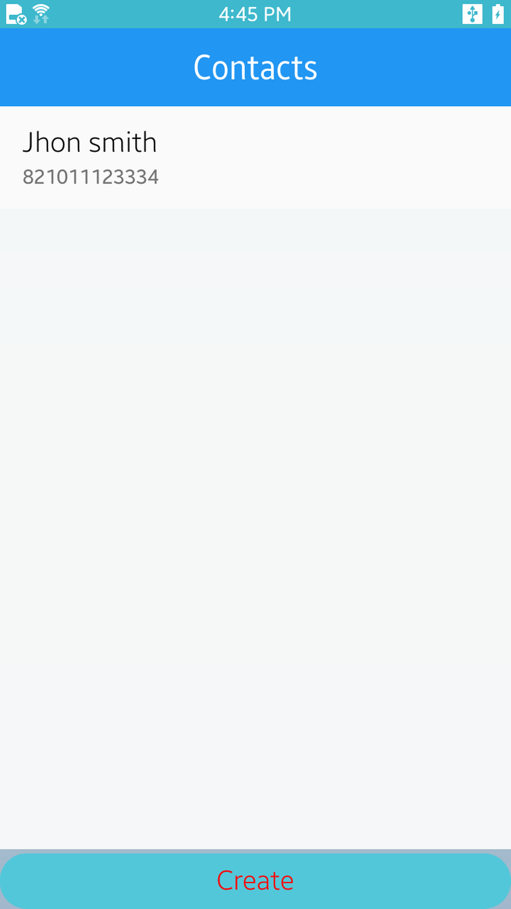
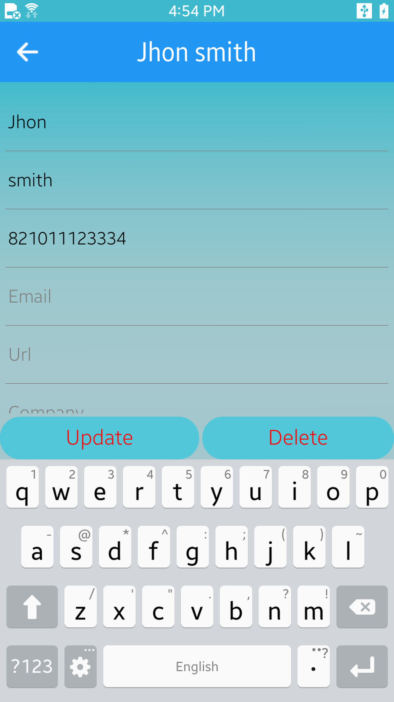

# Tizen .NET Contacts

The Contacts application demonstrates how to implement an contacts service which can add and configure an contacts.
This sample is following Portable Class Libraries (PCL) application model and using some Xamarin.Forms features such as XAML files for GUI, and subsystem ports by using the Dependency Service.

<table>
<tr>
<td>

</td>
<td>

</td>
</tr>
</table>

## Getting Started

These instructions will get you a copy of the project up and running on your local machine for development and testing purposes. See deployment for notes on how to deploy the project.

### Prerequisites

* [Visual Studio](https://www.visualstudio.com/) - Buildtool, IDE
* [Visual Studio Tools for Tizen](https://docs.tizen.org/application/vstools/install) - Visual Studio plugin for Tizen .net app development.

## Acknowledgments
