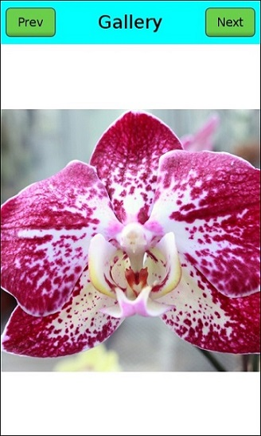

# FlexContainer Gallery Example

Simple example of [Tizen.NUI.BaseComponents.FlexContainer](https://samsung.github.io/TizenFX/latest/api/Tizen.NUI.BaseComponents.FlexContainer.html) usage.

### Gallery app view

### Verified Version
* Tizen.Net : 6.0.0
* Tizen.Net.SDK : 1.0.9

### Supported Profile
* All

### Prerequisites
* [Visual Studio](https://www.visualstudio.com/) - Buildtool, IDE
* [Visual Studio Tools for Tizen](https://docs.tizen.org/application/vstools/install) - Visual Studio plugin for Tizen .NET application development

