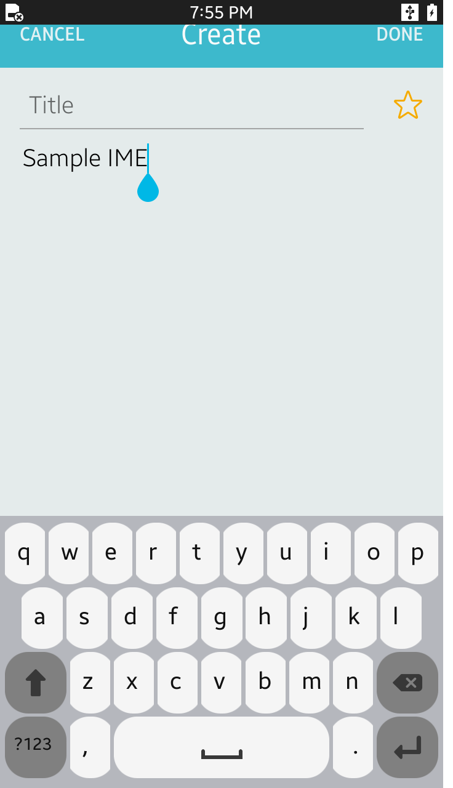

# IMESample
This is a simple project for C# IME(Input Method Editor) Application, which lets you create your own IME.
SampleIME is mainly designed for Tizen Mobile profile.

### Verified Version
* Xamarin.Forms : 3.4.0.1008975
* Tizen.NET : 5.0.0.14594
* Tizen.NET.SDK : 1.0.1

### Supported Profile
* Mobile

### Author
* Sungwook Park (sungwook79.park@samsung.com)
* Inhong Han (inhong1.han@samsung.com)
