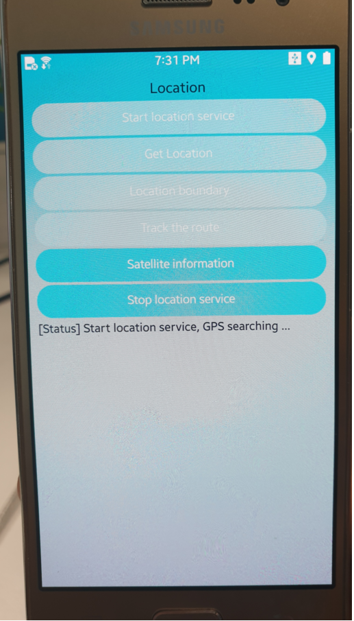

# Location
This sample application demonstrates how to implement location.

### Features
* Location information of a place with additional navigation.

### Prerequisites

* [Visual Studio](https://www.visualstudio.com/) - Buildtool, IDE
* [Visual Studio Tools for Tizen](https://developer.tizen.org/development/visual-studio-tools-tizen/installing-visual-studio-tools-tizen) - Visual Studio plugin for Tizen .NET application development

### Installing

* Build Location source codes by the Visual Studio.
* Run Tizen mobile emulator/ Connect Tizen Mobile device.
* Install build output tpk file to the Tizen mobile emulator/ Mobile.

### Precondition

* GPS should be "ON" in testing device for Location.

## Running the tests

* Build source codes by Visual Studio
* Visual Studio > Test > Run > All Tests

