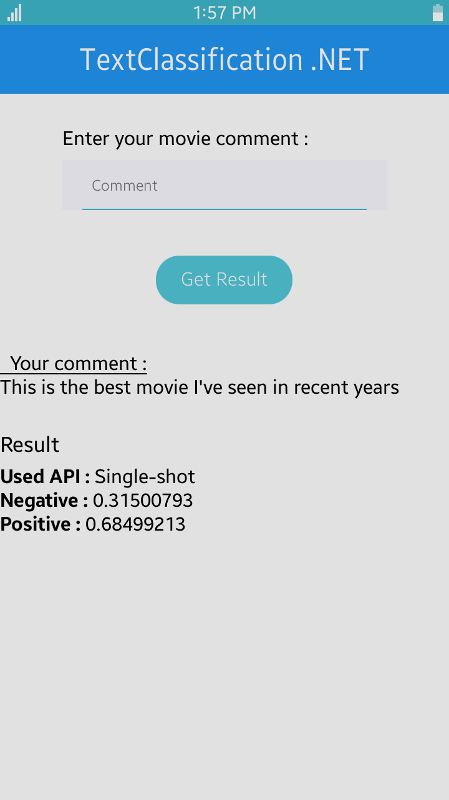

# TextClassification
This sample application provides a guide for how to use the nnstreamer single-shot API.

Text classifications are classified into predefined groups based on sentences.
Pre-trained models predict whether a paragraph is positive or negative.

The model is downloaded here : https://www.tensorflow.org/lite/models/text_classification/overview

<table>
<tr>
<td>

</td>
</tr>
</table>

### Prerequisites
* [Visual Studio](https://www.visualstudio.com/) - Buildtool, IDE
* [Visual Studio Tools for Tizen](https://docs.tizen.org/application/vstools/index) - Visual Studio plugin for Tizen .NET application development
