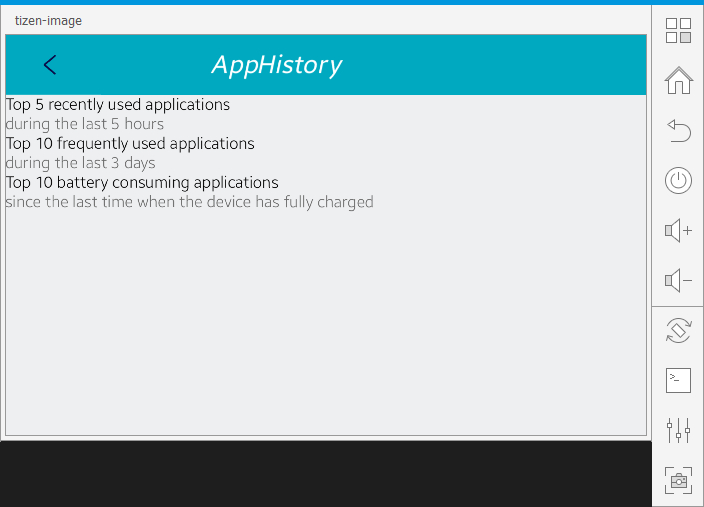
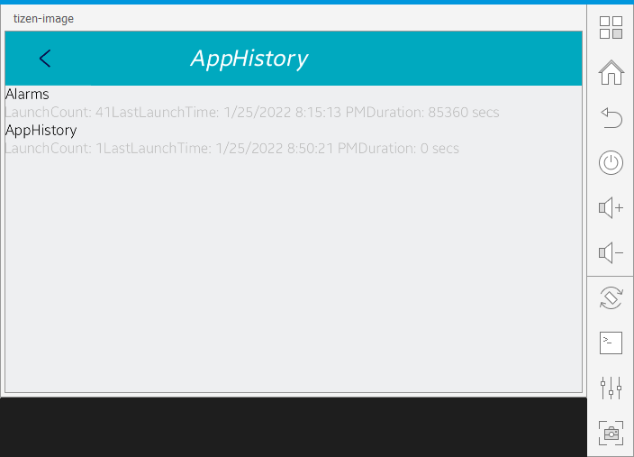

# AppHistory

The AppHistory sample application demonstrates how you can retrieve the user's application usage patterns.
This sample is following Portable Class Libraries (PCL) application model and using some Xamarin.Forms features such as XAML files for GUI, and subsystem ports by using the Dependency Service.

<table>
<tr>
<td>

</td>
<td>

</td>
</tr>
</table>

### Verified Version
* Xamarin.Forms : 4.5.0
* Tizen.NET : 6.0.0
* Tizen.NET.SDK : 1.0.9

### Supported Profile
* Mobile

### Author
* Somin Kim
