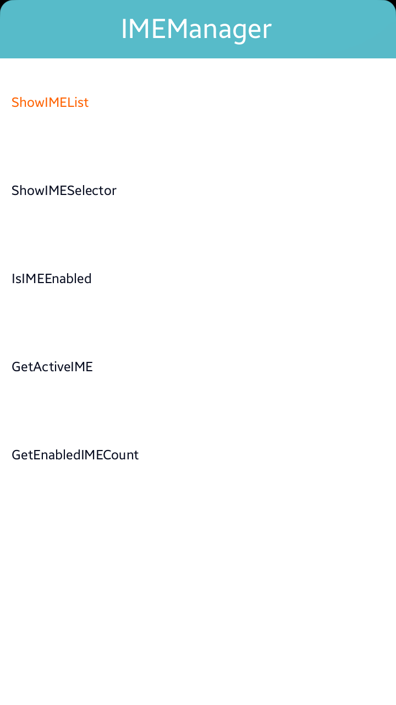

# IMEManager
This is a sample project for C# IME(Input Method Editor) manager Application using NUI, which demonstrates how to use InputMethodManager API. IMEManager is mainly designed for Tizen Mobile profile.

### Verified Version
* Tizen.NET : 10.0.0.17577
* Tizen.NET.SDK : 7.0

### Supported Profile
* Mobile

### Author
* AbedalrahmanRasem (a.sheikha@samsung.com)
* Feras Hamam (f.hamam@partner.samsung.com)

