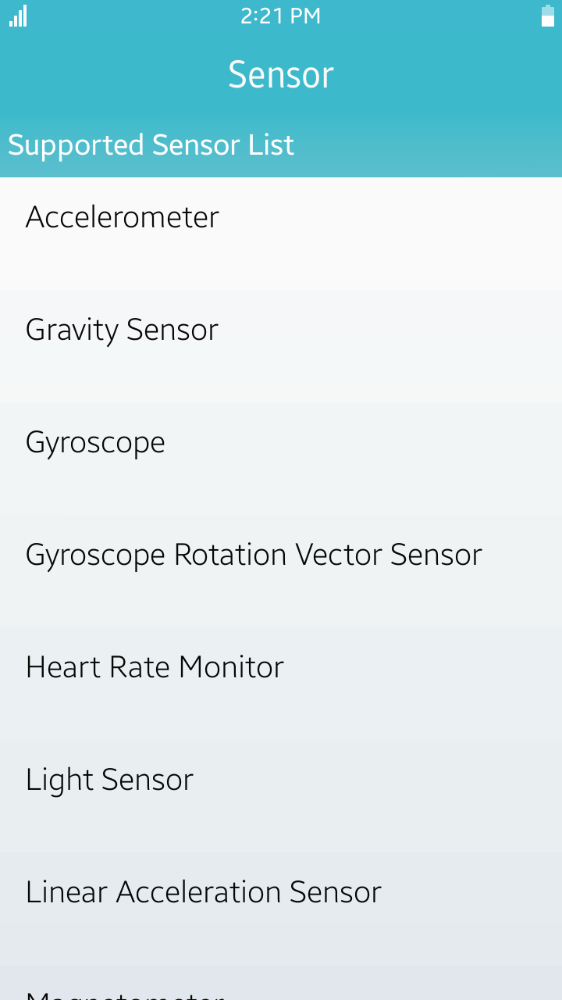
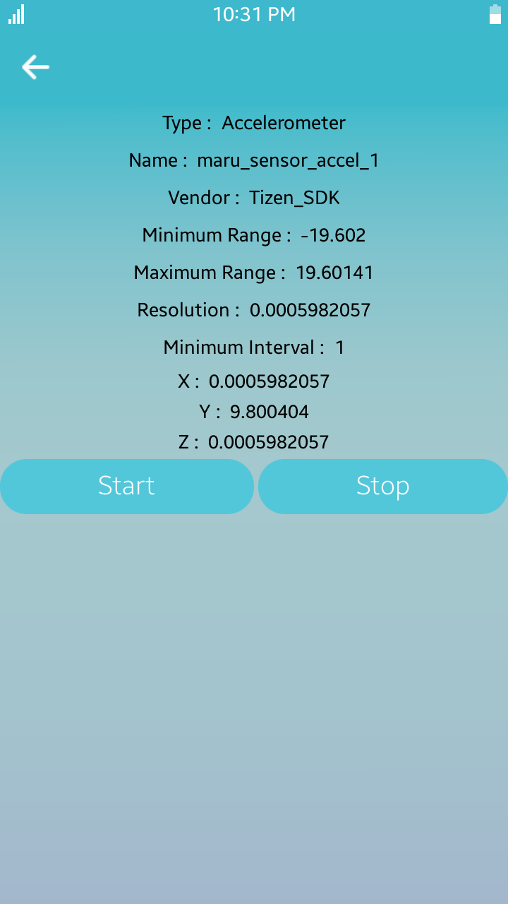

# Sensor
The Sensor sample application demonstrates how you can manage sensors and retrieve sensor data from various tizen sensor types, such as acceleration, device orientation and gravity sensor.
This sample is following Portable Class Libraries (PCL) application model and using some NUI Xaml features such as XAML files for GUI.

<table>
<tr>
<td>

</td>
<td>

</td>
</tr>
</table>

### Verified Version
* Tizen.NET : 10.0.0.17606

### Supported Profile
* Mobile

### Author
* Guowei Wang(guowei.wang@samsung.com)
