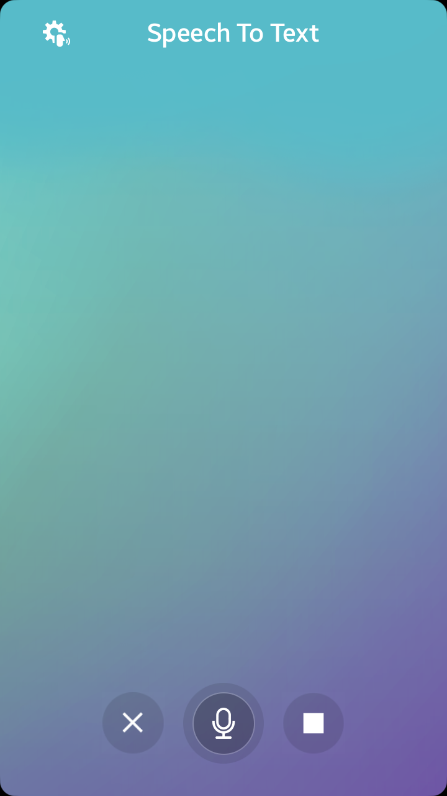
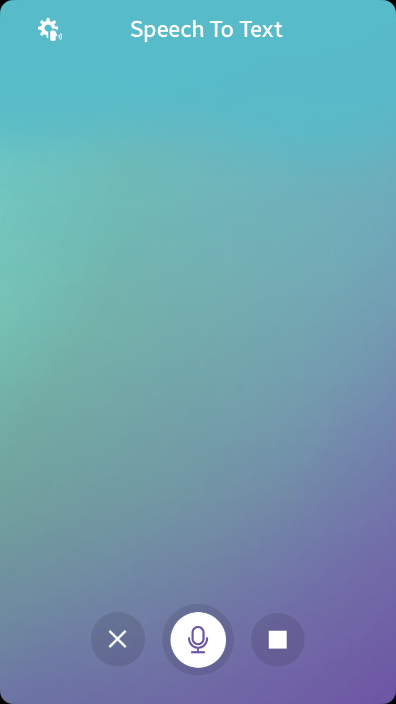
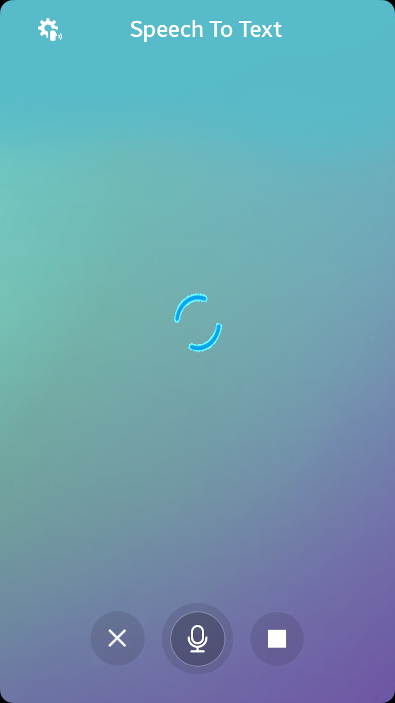
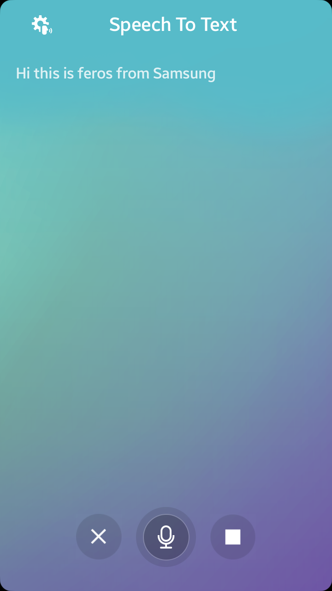
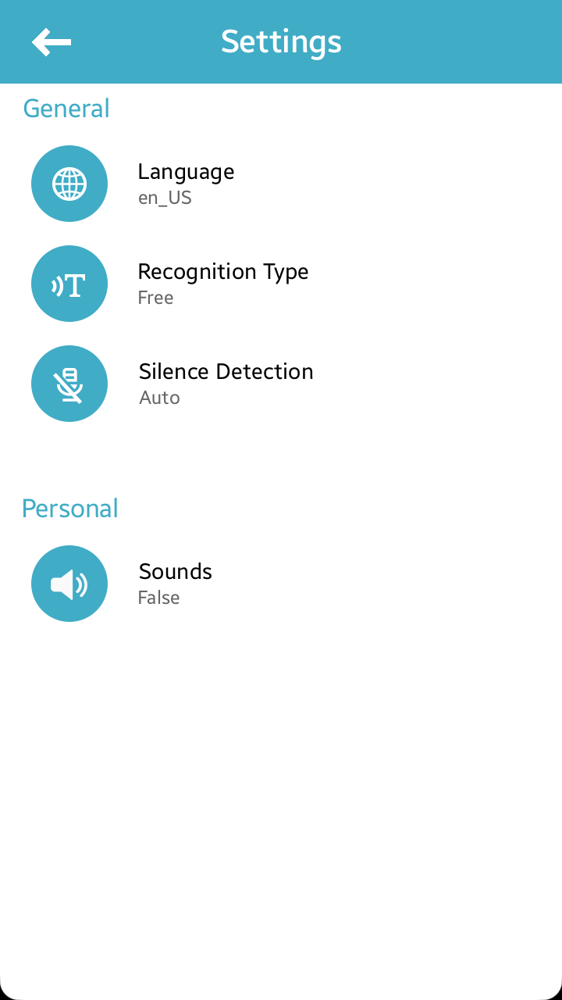

# SpeechToText
SpeechToText is a sample application which demonstrates how to record and recognize
sound data using [Tizen STT API](https://docs.tizen.org/application/dotnet/guides/uix/stt/) in NUI.

### Verified Version
* Tizen.NET : 10.0.0.17614
* Tizen.NET.SDK : 5.0

### Features
* Starting/Pausing/Stopping Recognition
* Clearing results
* Settings - Language
* Settings - Recognition type
* Settings - Silence detection
* Settings - Sounds (start, end)

### Prerequisites
* [Visual Studio](https://www.visualstudio.com/) - Buildtool, IDE
* [Tizen Studio](https://developer.tizen.org/development/tizen-studio/) - Tizen Studio
* [Visual Studio Tools for Tizen](https://docs.tizen.org/application/vstools/install) - Visual Studio plugin for Tizen .NET application development

### Author
* Feras Hamam (f.hamam@partner.samsung.com)
