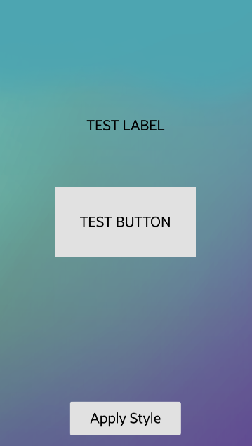
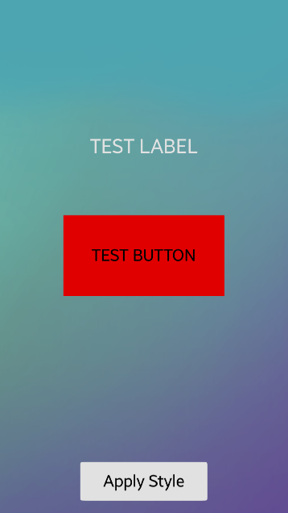

# NUI_StylingComponents
This sample application demonstrates how to style NUI components using theme written in JSON file.

Main page without style          |       Main page with style
:-------------------------------:|:---------------------------------:
 | 

### Prerequisites
* [Visual Studio](https://www.visualstudio.com/) - Buildtool, IDE
* [Visual Studio Tools for Tizen](https://docs.tizen.org/application/vstools/install) - Visual Studio plugin for Tizen .NET application development 