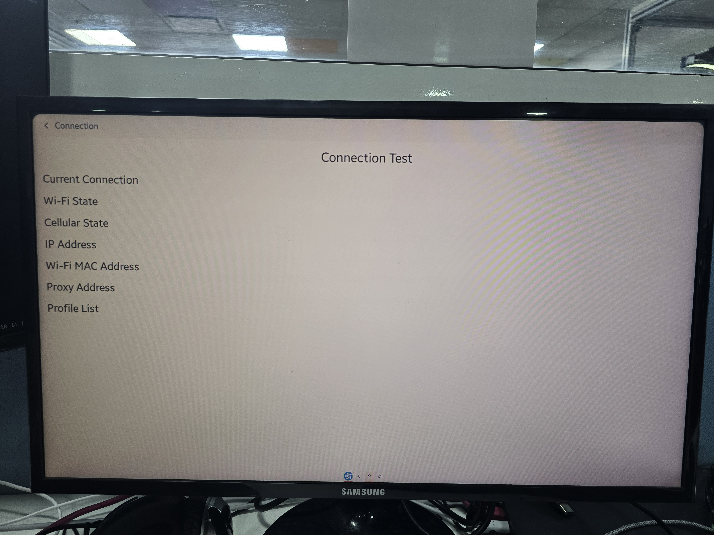
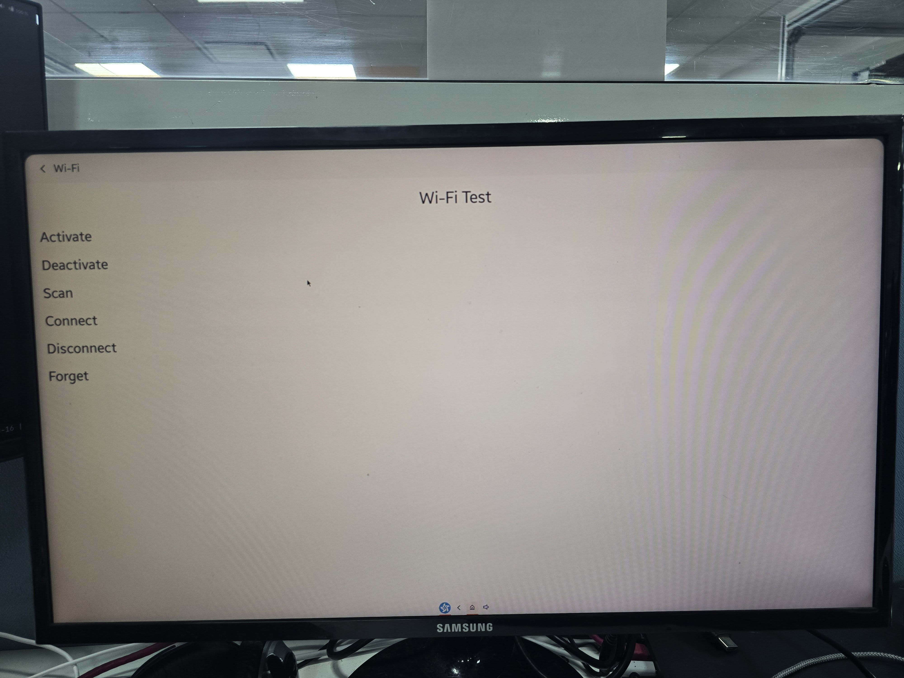
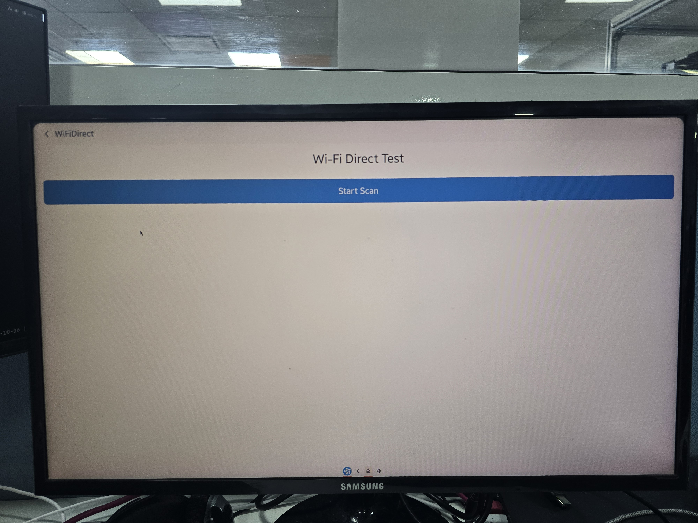

# NetworkApp
The NetworkApp application demonstrates how user can get network information, connect Wi-Fi APs and scan Wi-Fi Direct peer devices.

### Verified Version
* Tizen.NET : 6.0.428
* Tizen.NET.SDK : 10.0.111

### Supported Profile
* Tizen 10.0 RPI4

### Author
* Harish Nanu J
