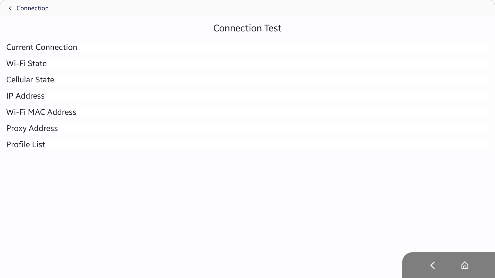
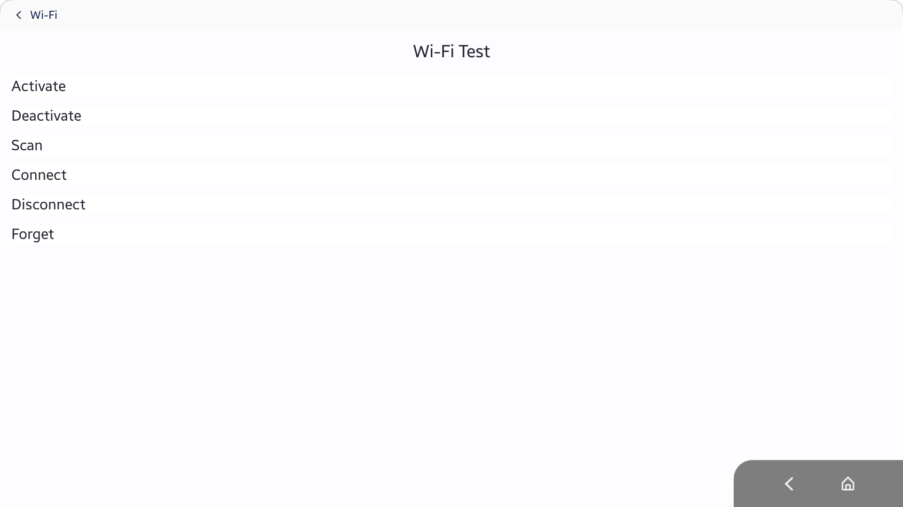
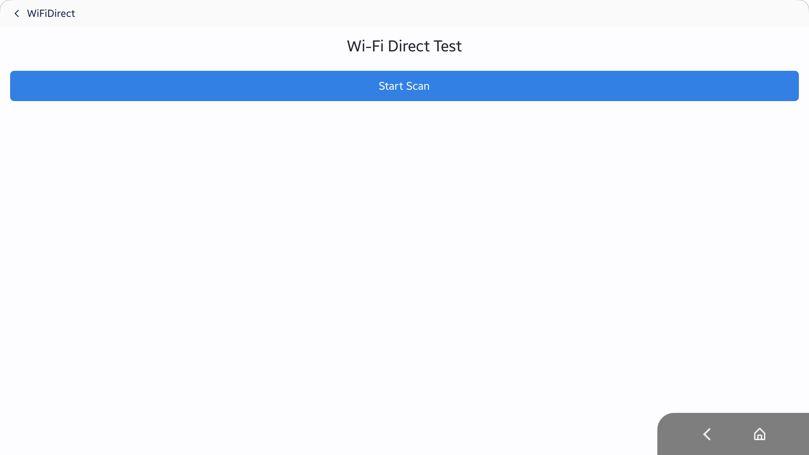

# NetworkApp
The NetworkApp application demonstrates how user can get network information, connect Wi-Fi APs and scan Wi-Fi Direct peer devices. This sample is mainly designed for Tizen Mobile profile.

### Verified Version
* Xamarin.Forms : 2.5.0.91635
* Xamarin.Platform.Tizen : 2.5.0.77107
* Tizen.NET : 4.0.0
* Tizen.NET.SDK : 1.0.0

### Supported Profile
* Mobile

### Author
* Cheoleun Moon
