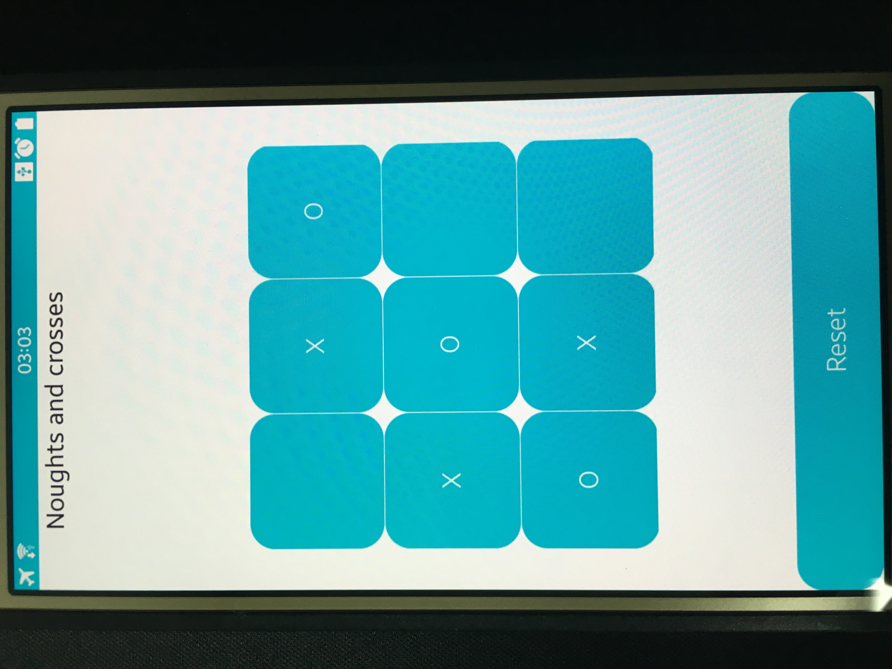

# Noughts and crosses

<table>
<tr>
<td>

</td>
</tr>
</table>

### Features
* 간단 삼목게임

### Prerequisites
* [Visual Studio](https://www.visualstudio.com/) - Buildtool, IDE
* [Visual Studio Tools for Tizen](https://developer.tizen.org/development/tizen-.net-preview/visual-studio-tools-tizen) - Visual Studio plugin for Tizen .NET application development

### Supported Profile
* Mobile

### Author
* HyunWoo Kim
