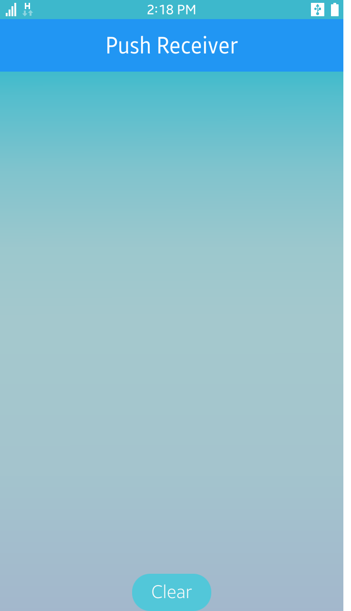

# Push Receiver

The Push Receiver sample application demonstrates how you can receive push notification from application server through push server. This sample is following Portable Class Libraries (PCL) application model and using some Xamarin.Forms features such as XAML files for GUI, and subsystem ports by using the Dependency Service.
The following figure illustrates the main screen of the Push Receiver sample application.

<table>
<tr><td>

</td></tr>
</table>

The application opens with the main screen, which displays just a button for clearing list of push message:
* To receive push notification, there needs either separated application server to send push request or a command for sending push notification to SPP server by using curl.
* Example of the command is like below:

\'$ curl -k --header "__appID__: 51242f336c585db3" --header "__appSecret__: 238F539EC07F2B2CAF05B9D238E15362" __https://apnortheast.push.samsungosp.com:8090/spp/pns/api/push__ --header "Content-Type: application/json" -d "{\"__regID__\": \"05013fe0b87302eafcbf26e454da3fdc1e4f2bd8cad93f1ba05a97e9ced44127afbea2510832b51b3ac1356eb78ab870d7c9\", \"requestID\": \"0000001\", \"__message__\":\"badgeOption=INCREASE&badgeNumber=1&action=ALERT&alertMessage=Hi\", \"appData\": \"{id:qwer12&passwd:1234}\"}"\'


## Getting Started
These instructions will get you a copy of the project up and running on your local machine for development and testing purposes. See deployment for notes on how to deploy the project.


### Prerequisites
* [Visual Studio](https://www.visualstudio.com/) - Buildtool, IDE
* [Visual Studio Tools for Tizen](https://developer.tizen.org/development/tizen-.net-preview/visual-studio-tools-tizen) - Visual Studio plugin for Tizen .net app development.


### Installing
* Build PushReceiver source codes by the Visual Studio.
* Run Tizen mobile emulator.
* Install build output tpk file to the Tizen mobile emulator.

```
d:\> "C:\Program Files (x86)\Tizen\SDK\tools\sdb.exe" install org.tizen.example.PushReceiver.Tizen.Mobile-1.0.0.tpk
```


### Running the tests
* Build source codes by Visual Studio
* Visual Studio > Test > Run > All Tests


### Verified Version
* Xamarin.Forms : 2.4.0.18342
* Xamarin.Platform.Tizen : 2.4.0.18342
* Tizen.NET : 4.0.0
* Tizen.NET.SDK : 1.0.0


### Supported Profile
* Mobile


### Author
* Younho Park
