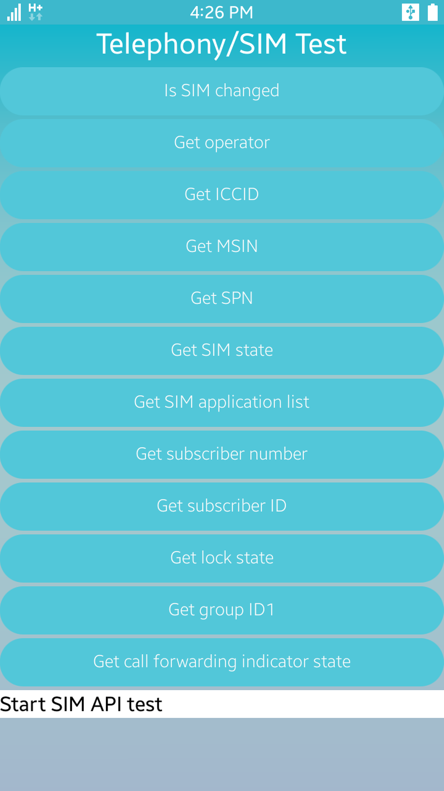

# Telephony
The SampleTelephony application demonstrates how to work with Telephony API in order to get call, modem, network and sim information from telephony framweork.
SampleTelephony is mainly designed for Tizen Mobile profile and it is written in [Developer Site](https://developer.tizen.org/development/guides/.net-application/connectivity-and-wireless/telephony-information).

### Verified Version
* Xamarin.Forms : 2.4.0.18342
* Xamarin.Platform.Tizen : 2.4.0.18342
* Tizen.NET : 4.0.0
* Tizen.NET.SDK : 1.0.0

### Supported Profile
* Mobile

### Author
* Shinhui Kang (sinikang@samsung.com)
