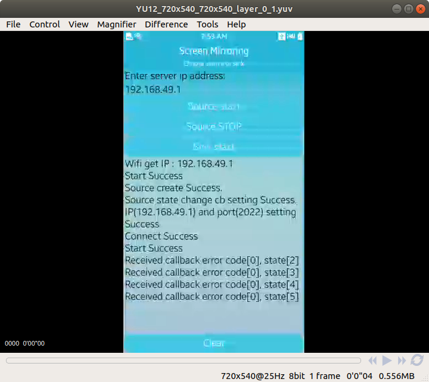

# ScreenMirroringSample

The ScreenMirroringSample application demonstrates how to implement a ScreenMirorring who wants to make ScreenMirroring service using Wi-Fi Direct.

<table>
    <tr>
        <td>
            
            
        </td>
    </tr>
</table>

## Getting Started
These instructions will get you a copy of the project up and running on your local machine for development and testing purposes. See deployment for notes on how to deploy the project.

### Prerequisities

* [Visual Studio](https://www.visualstudio.com/) - Buildtool, IDE
* [Visual Studio Tools for Tizen](https://developer.tizen.org/development/tizen-.net-preview/visual-studio-tools-tizen) - Visual Studio plugin for Tizen .net app development.

### Installing

 * Build ScreenMirroringSample source codes using Visual Studio.
 * Install TPK file whick is generated after build on target device.

 ```
 c:\> "C:\Program Files (x86)\Tizen\SDK\tools\sdb.exe" install org.tizen.example.ScreenMirroringSample.Tizen.Mobile-1.0.0.tpk
 ```

# Running the tests

* Connect to source device with Wi-Fi Direct.
* Touch 'PrepareCommand' button.
* After, touch 'StartCommand' button.
* You can watch mirrored screen by source on your target.
