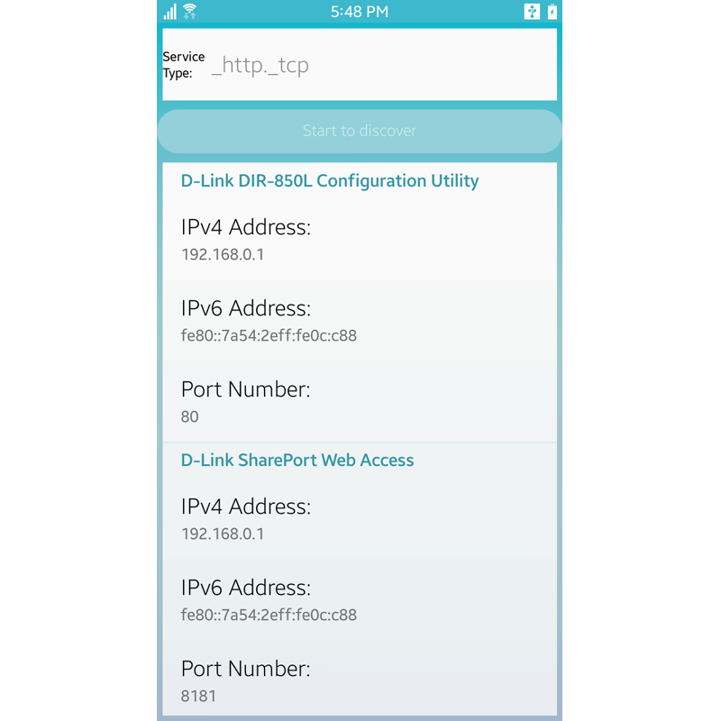

# ServiceDiscovery
The ServiceDiscovery application demonstrates how user can register and discover a DNS-SD service within local network.
This sample is mainly designed for Tizen Mobile profile.

### Verified Version
* Xamarin.Forms : 4.5.0
* Tizen.NET : 6.0.0
* Tizen.NET.SDK : 1.0.9

### Supported Profile
* Mobile

### Author
* Cheoleun Moon
