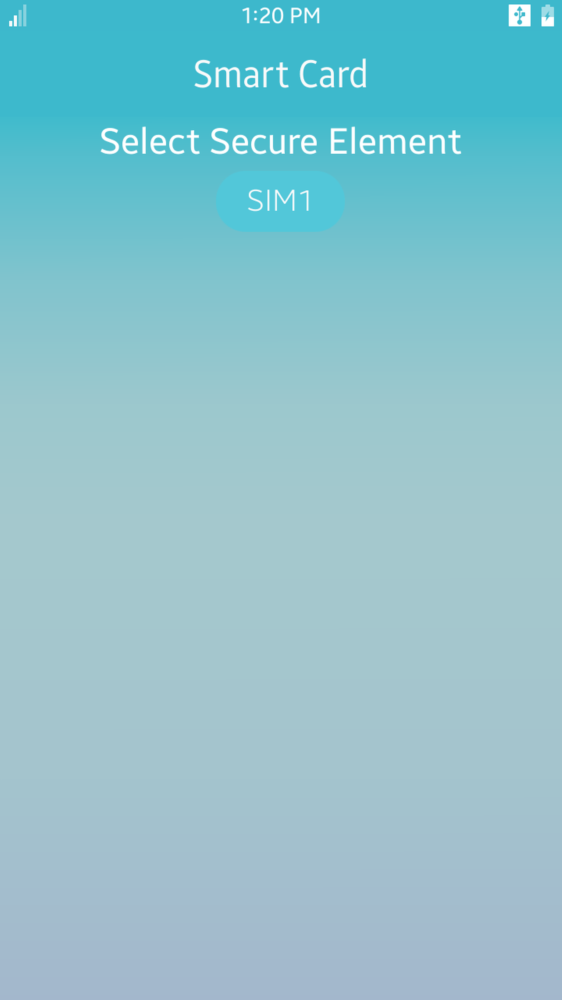

# Smartcard
The Smartcard service allows you to send a command to the SE (Secure Element), and receive a response to the command.
Smartcard sample is mainly designed for Tizen Mobile profile and it is written in [Developer Site](https://developer.tizen.org/development/guides/native-application/connectivity-and-wireless/smartcard).

### Verified Version
* Xamarin.Forms : 4.5.0
* Tizen.NET : 6.0.0
* Tizen.NET.SDK : 1.0.9

### Supported Profile
* Mobile

### Author
* Jihoon Jung
