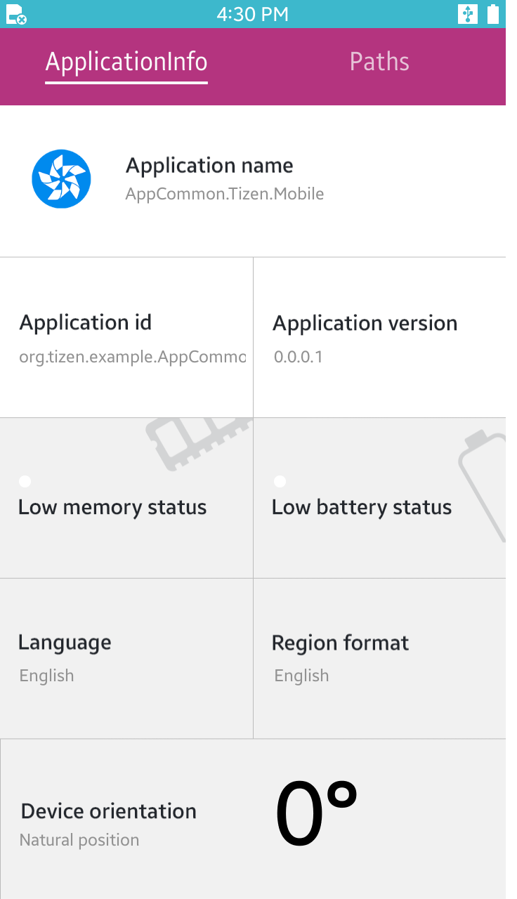

# Tizen .NET AppCommon Sample

The AppCommon application demonstrates how to work with app-common API in order to obtain application-specific information.

<table>
<tr>
<td>

</td>
</tr>
</table>

### Verified Version
* Xamarin.Forms : 2.4.0.18342
* Xamarin.Platform.Tizen : 2.4.0.18342
* Tizen.Xamarin.Forms.Extension : 2.4.0-v00014
* Tizen.NET : 4.0.0
* Tizen.NET.SDK : 1.0.0

### Supported Profile
* Mobile

### Author
* Jeong-Kyun Pu, Hyunjin Park
