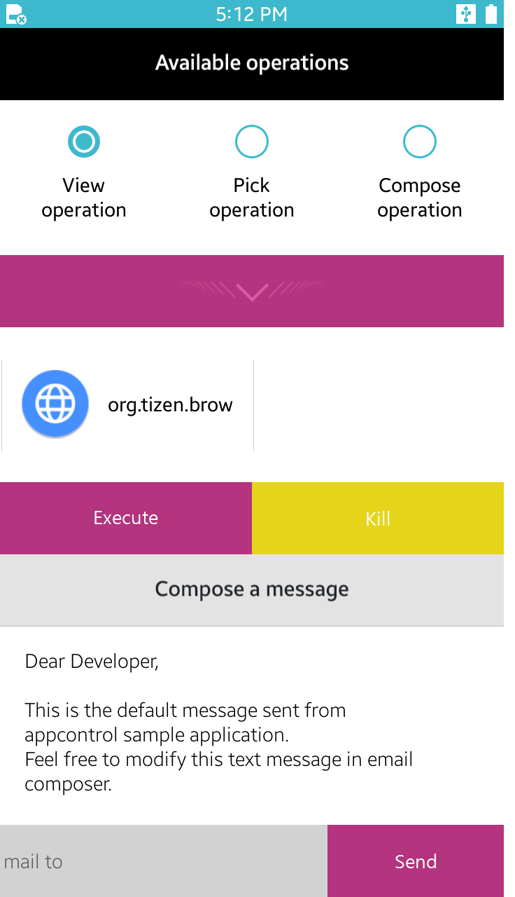

# Tizen .NET ApplicationControl Sample

The ApplicationControl application demonstrates how you can find applications supporting certain classes of operations and run them using those operations contexts. It uses Application control API.

<table>
<tr>
<td>
<center></center>
</td>
</tr>
</table>

## Getting Started

These instructions will get you a copy of the project up and running on your local machine for development and testing purposes. See deployment for notes on how to deploy the project.

### Prerequisites

* [Visual Studio](https://www.visualstudio.com/) - Buildtool, IDE
* [Visual Studio Tools for Tizen](https://developer.tizen.org/development/tizen-.net-preview/visual-studio-tools-tizen) - Visual Studio plugin for Tizen .net app development.

### Installing

* Build ApplicationControl source codes by the Visual Studio.
* Run Tizen mobile emulator.
* Install build output tpk file to the Tizen mobile emulator.

```
d:\> "C:\Program Files (x86)\Tizen\SDK\tools\sdb.exe" install org.tizen.example.ApplicationControl.Tizen.Mobile-1.0.0.tpk
```

## Running the tests

* Build source codes by Visual Studio
* Visual Studio > Test > Run > All Tests

## Acknowledgments
