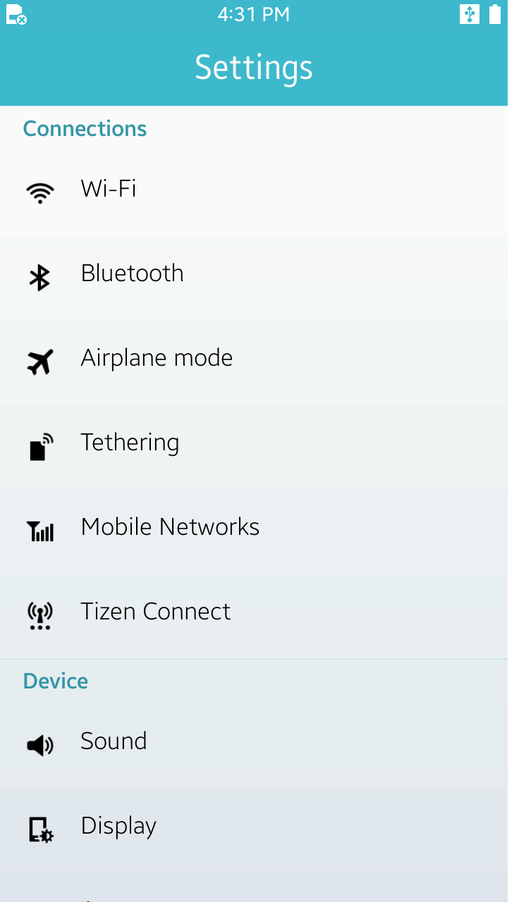

# Settings UI

This Settings UI sample application demonstrates how to configure the screen using a variety of objects. This sample is only a reference for constructing an application's UI layout. Menus and UI components do not provide real application's functions.

<table>
<tr>
<td>

</td>
</tr>
</table>

### Verified Version
* Xamarin.Forms : 2.4.0.18342
* Xamarin.Platform.Tizen : 2.4.0.18342
* Tizen.NET : 4.0.0
* Tizen.NET.SDK : 1.0.0

### Supported Profile
* Mobile

### Author
* Jeong-Kyun Pu
