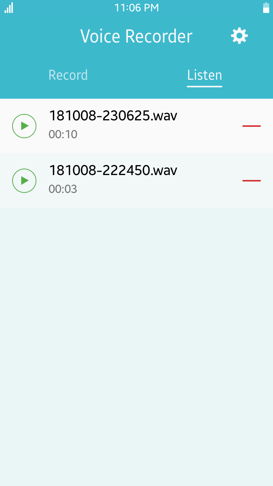

# VoiceRecorder
VoiceRecorder is a sample application which demonstrates how to control audio
recording using [Tizen Multimedia API](https://developer.tizen.org/dev-guide/csapi/api/Tizen.Multimedia.html).

### Features
* Audio file recording
* Recordings playback
* Settings - record in stereo
* Settings - recording quality
* Settings - file format

### Prerequisites

* [Visual Studio](https://www.visualstudio.com/) - Buildtool, IDE
* [Visual Studio Tools for Tizen](https://developer.tizen.org/development/visual-studio-tools-tizen/installing-visual-studio-tools-tizen) - Visual Studio plugin for Tizen .NET application development

### Author
* Mateusz Szperna
