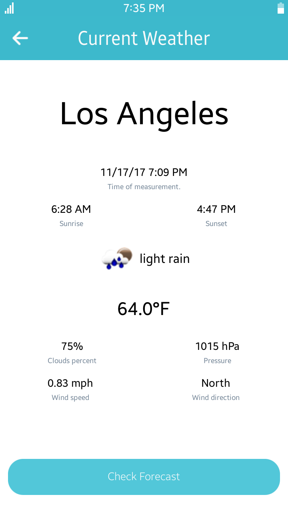
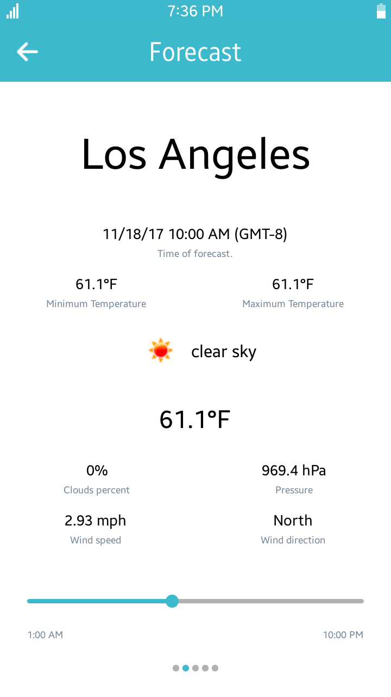

# Weather
Weather is a sample application that demonstrates how to obtain data provided by the RESTful API using the [OpenWeatherMap](<https://openweathermap.org/>) API.

### Features
* Checking current weather in the biggset US cities.
* Checking forecast for next 5 days.

### Prerequisites
* [Visual Studio](https://www.visualstudio.com/) - Buildtool, IDE
* [Visual Studio Tools for Tizen](https://developer.tizen.org/development/tizen-.net-preview/visual-studio-tools-tizen) - Visual Studio plugin for Tizen .NET application development

### Author
* Michał Kołodziejski