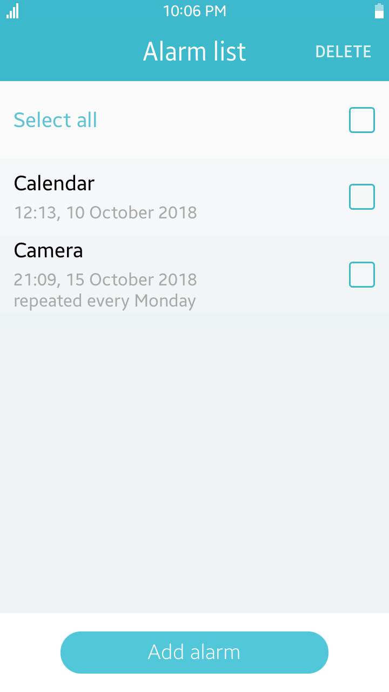
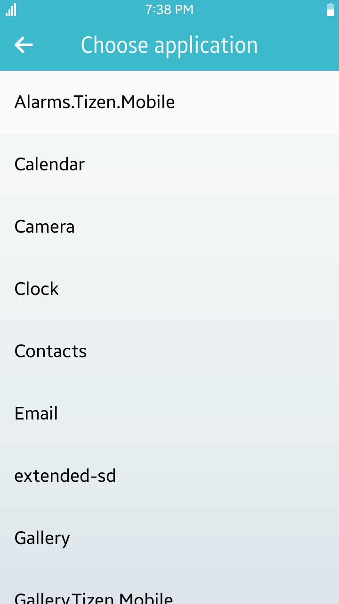
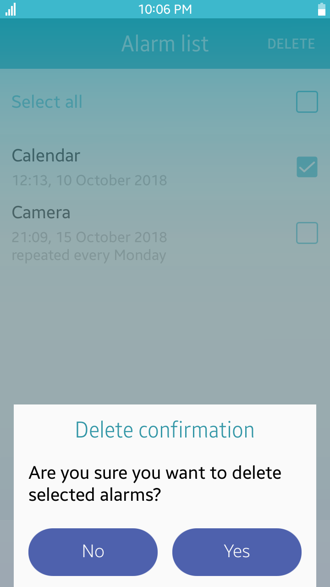

# Alarms
Alarms is a sample application that demonstrates how to schedule start of application at specified date and time or after delay using [Tizen Applications API](https://developer.tizen.org/dev-guide/csapi/api/Tizen.Applications.html).

### Features
* Creating alarm to be triggered after some delay
* Creating alarm to be triggered at specified date in the future
* Removing alarms
* Triggering alarms by launching specified applications

### Prerequisites
* [Visual Studio](https://www.visualstudio.com/) - Buildtool, IDE
* [Visual Studio Tools for Tizen](https://developer.tizen.org/development/tizen-.net-preview/visual-studio-tools-tizen) - Visual Studio plugin for Tizen .NET application development

### Author
* Dariusz Paziewski