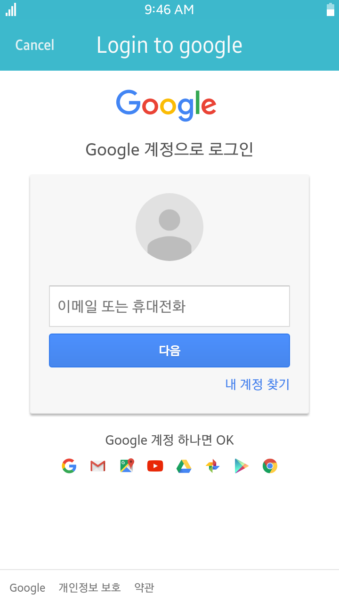

# Google API client Example

This example is [Google API .net client](https://github.com/googleapis/google-api-dotnet-client) usage in Tizen .net

Introduction
------------
Google Drive API example

<table>
<tr>
    <td>

</td>
<td>

</td>
<td>

</td>
</tr>
</table>

### Verified Version
* Xamarin.Forms : 4.1.0.555618
* Xamarin.Platform.Tizen : 4.1.0.555618
* Tizen.NET : 4.0.0
* Tizen.NET.SDK : 1.0.0

### Supported Profile
* All

### Author
* Seungkeun Lee

