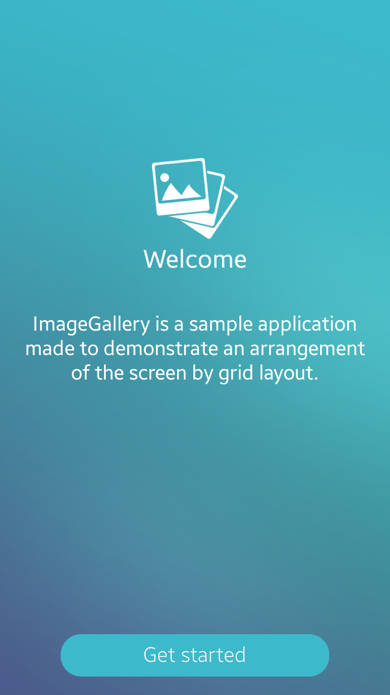

# ImageGallery
ImageGallery is a sample application that demonstrates how to create image viewer using [Tizen Content API](https://developer.tizen.org/dev-guide/csapi/api/Tizen.Content.MediaContent.html).

### Features
* Browsing images
* Removing images
* Adding images to favorites

### Prerequisites
* [Visual Studio](https://www.visualstudio.com/) - Buildtool, IDE
* [Visual Studio Tools for Tizen](https://developer.tizen.org/development/tizen-.net-preview/visual-studio-tools-tizen) - Visual Studio plugin for Tizen .NET application development

### Author
* Dariusz Paziewski