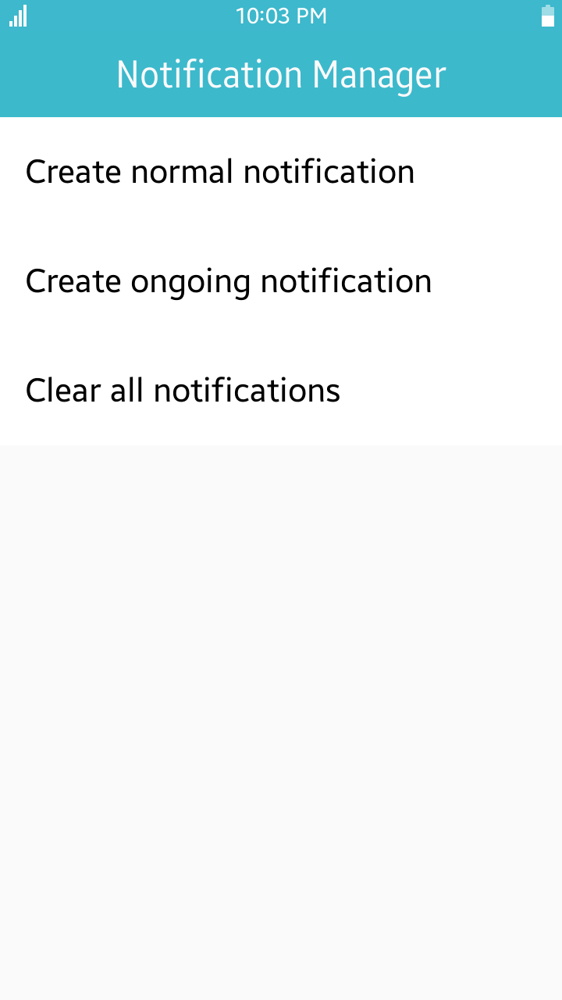
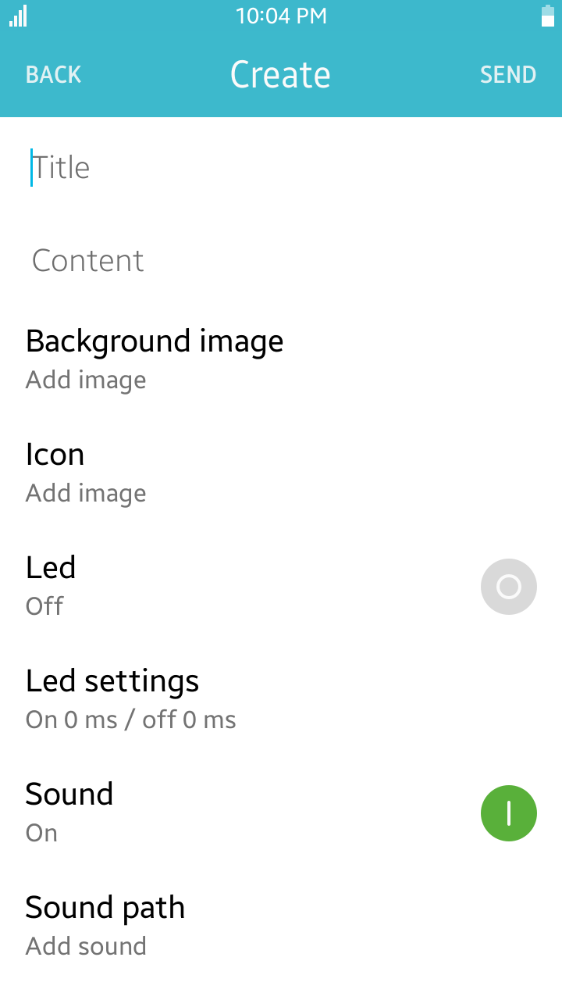
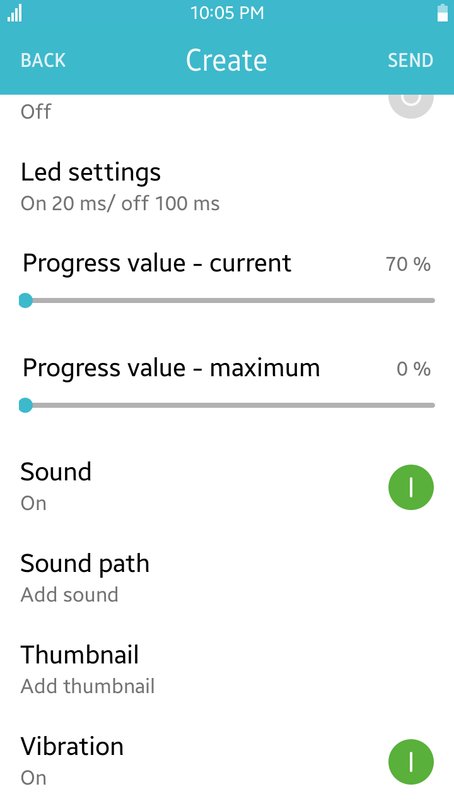
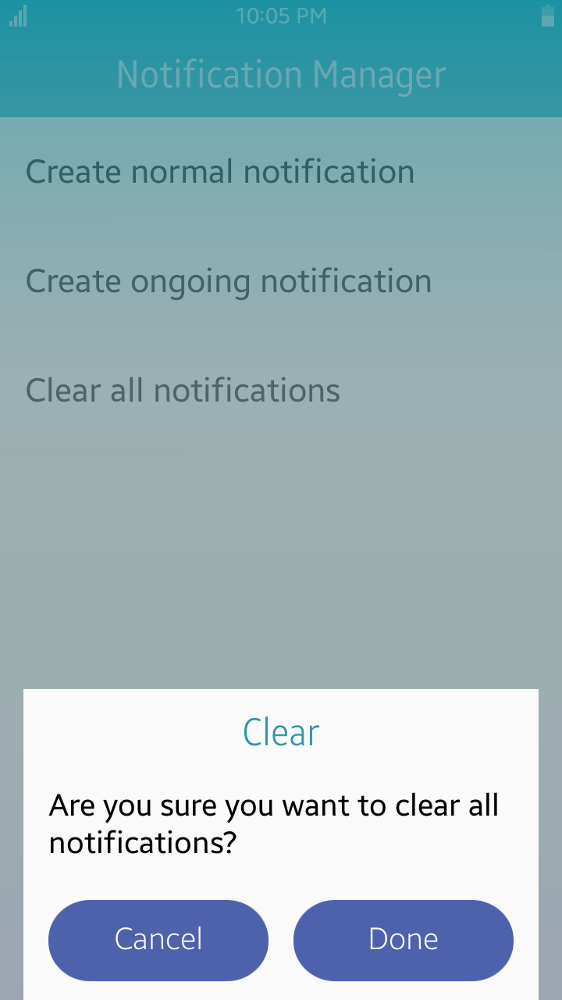

# NotificationManager
NotificationManager is a sample application that demonstrates how to create and manage notifications.

### Features
* Creating normal notification
* Creating ongoing notification
* Removing all notifications

### Prerequisites
* [Visual Studio](https://www.visualstudio.com/) - Buildtool, IDE
* [Visual Studio Tools for Tizen](https://developer.tizen.org/development/tizen-.net-preview/visual-studio-tools-tizen) - Visual Studio plugin for Tizen .NET application development

### Author
* Tomasz Bochenski