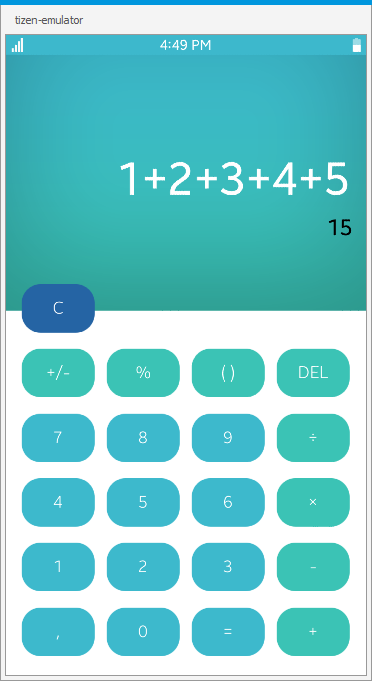

# BasicCalculator
BasicCalculator is a sample application which demonstrates how to create a calculator
with basic mathematical operations using NUI Xaml library.

### Features
* Preview of the result
* Basic mathematical operations

### Prerequisites

* [Visual Studio](https://www.visualstudio.com/) - Buildtool, IDE
* [Visual Studio Tools for Tizen](https://docs.tizen.org/application/vstools/install) - Visual Studio plugin for Tizen .NET application development

### Author
* Guowei Wang
