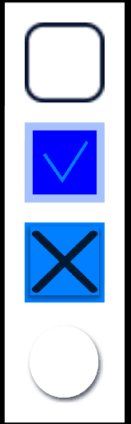
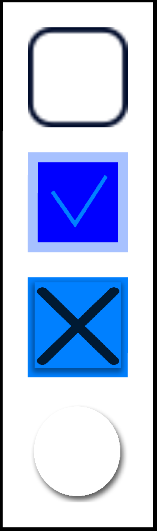

# NUI_CheckBox

**This sample application demonstrates how to use NUI CheckBox.**

Checkbox is a UI component connected with the click events.
The base class for a `CheckBox` class is a `Button`, which properties can be used to specify the checkbox.

The sample application reacts to the click event, after which it changes the background color.
The animation illustrating the app behavior is as follows:

For more information about the checkbox see the [NUI guide (Tizen.NET.API8 version)](https://docs.tizen.org/application/dotnet/guides/nui/nui-components/CheckBox/).

This sample works for Tizen.NET.API9 version 9.0.0.16813 or higher.
