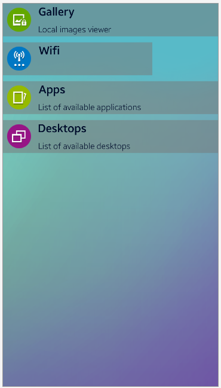

# NUI_CustomLayout

**This sample application demonstrates how to create NUI Custom Layout component.**

NUI provides standard layout components such as Linear Layout, Grid Layout, Flexible layout. 
However, sometimes there is a need to create you own layout, e.g in case of repeating list elements. For this purpose, NUI provides an LayoutGroup object w to make your work easier. There are only two interfaces which should be implemented:

```
protected override void onMeasure(MeasureSpecification widthMeasureSpec, MeasureSpecification heightMeasureSpec)
{
    var width = new LayoutWidth(0);
    var height = new LayoutWidth(0);

    //Usually here you should foreach each added item for calculate layout width and height:
    foreach(LayoutItem child in LayoutChildren)
    {
        //calculate width and height here using child item size
    }

    //When layout height and width will be know, you should use it in following way: 

    SetMeasuredDimensions(new MeasuredSize(itemWidth, MeasuredSize.StateType.MeasuredSizeOK),
                          new MeasuredSize(itemHeight, MeasuredSize.StateType.MeasuredSizeOK));
}

protected override void onLayout(bool changed, LayoutLength left, LayoutLength top, LayoutLength right, LayoutLength bottom)
{
    //Here position and size of each item should be set within the layout
    //similar as it is depicted in function above we can use foreach to access all children elements
    foreach (LayoutItem childLayout in LayoutChildren)
    {
        //set item position using following method
        childLayout.Layout(childLeft, childTop, childRight, childBottom);
    }
}
```

This sample app demonstrates how to create list items as it is depicted below. Example shows two different list items, with title and description and only with title. The second one has different width. 



### Prerequisites

* [Visual Studio](https://www.visualstudio.com/) - Buildtool, IDE
* [Visual Studio Tools for Tizen](https://docs.tizen.org/application/vstools/install) - Visual Studio plugin for Tizen .NET application development
