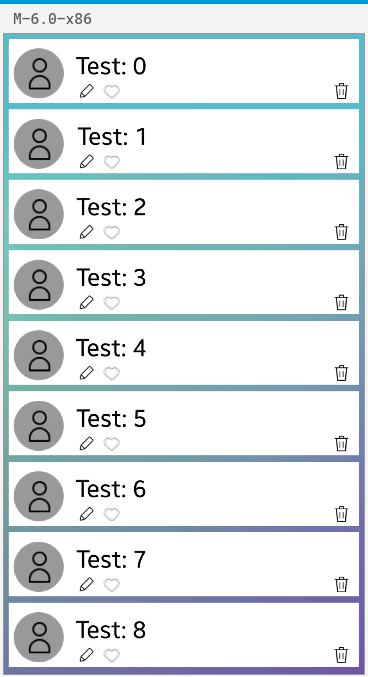

# CustomView

This sample application demonstrate how user can use NUI Custom View to implement own widget view. 

### Features
* Custom View implementation
* Basic Visuals usage example

### Prerequisites

* [Visual Studio](https://www.visualstudio.com/) - Buildtool, IDE
* [Visual Studio Tools for Tizen](https://docs.tizen.org/application/vstools/install) - Visual Studio plugin for Tizen .NET application development

### Precondition

* The Tizen mobile emulator
