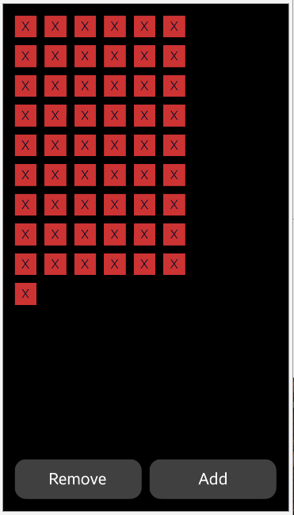
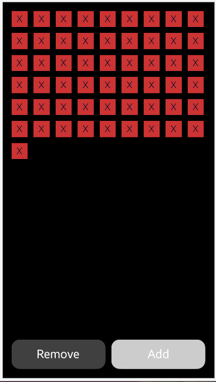

# NUIGridLayout
NUIGridLayout is a simple app that shows basic [NUI Grid Layout](https://docs.tizen.org/application/dotnet/guides/nui/grid-layout/).

### Features
* Press different buttons to see different layout options

### Author
* Mateusz Palkowski