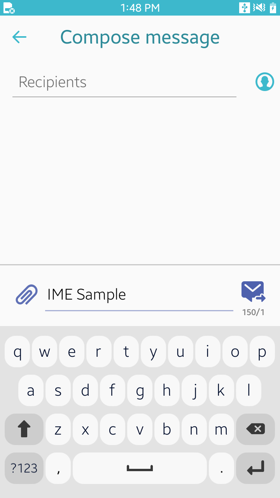

# IMESample
This is a sample project for C# IME(Input Method Editor) Application, which lets you create your own IME.
IMESample is mainly designed for Tizen Mobile profile.

### Verified Version
* Tizen.NET : 9.0.0.16715
* Tizen.NET.SDK : 1.1.6
* Tizen.NUI.XamlBuild : 1.0.28

### Supported Profile
* Mobile

### Author
* Inhong Han (inhong1.han@samsung.com)
