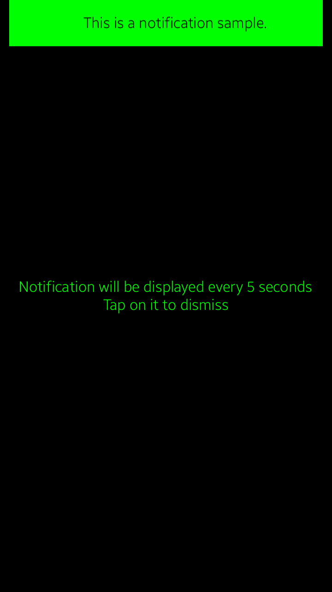

### NUINotificationExample
NUINotificationExample is a simple app that shows how [NUI Component Notification](https://docs.tizen.org/application/dotnet/guides/nui/nui-component/Notification/) usage example.

### Author
* Patryk Kaczmarek
