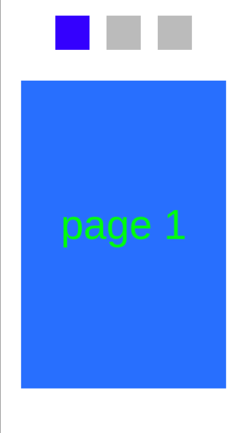
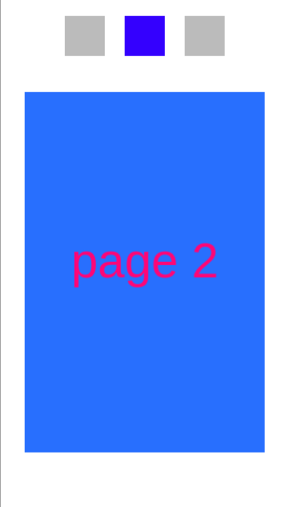
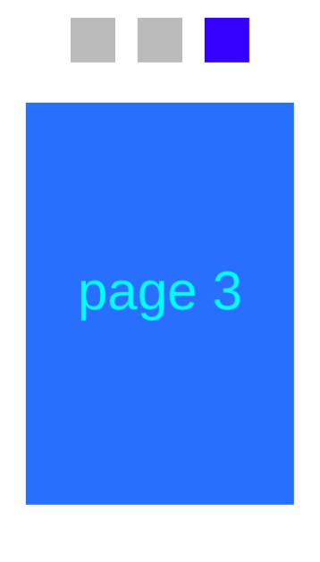

# NUI_Pagination

**This sample application demonstrates how to use NUI Pagination.**

`Pagination` is a component for making navigation through multipage windows more user-friendly.
It can be used to display the number of available pages and marking the currently viewed one.

The sample application reacts to the 'right' and 'left' arrows from the keyboard. After pressing either of them
the selected indicator of the pagination is switched accordingly and the screen is rolled.
The screenshots of the app are presented below:

For more information about the pagination see the [NUI guide](https://docs.tizen.org/application/dotnet/guides/nui/nui-components/Pagination/).
