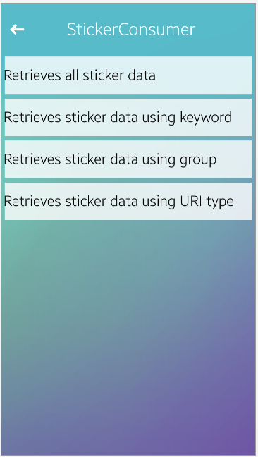

# StickerSample
These sample projects show you how to register and use sticker information.
Before running the StickerConsumerSample, you must install the StickerProviderSample first to register the sticker information.

### Verified Version
* Tizen.NET : 10.0.0.17063

### Author
* Inhong Han (inhong1.han@samsung.com)
