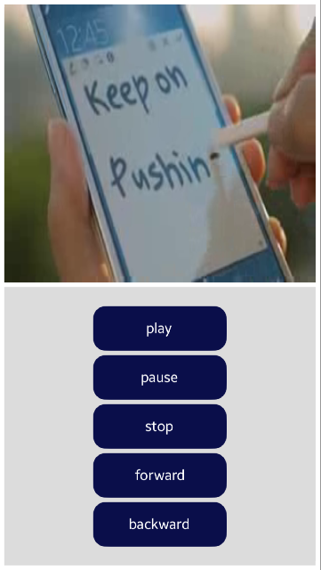

# VideoViewSample
This sample application demonstrates how to use NUI [VideoView](https://samsung.github.io/TizenFX/latest/api/Tizen.NUI.BaseComponents.VideoView.html) class. It perform how to use functionalities like forward, backward, play, pause or stop video.

### Prerequisites
* [Visual Studio](https://www.visualstudio.com/) - Buildtool, IDE
* [Visual Studio Tools for Tizen](https://docs.tizen.org/application/vstools/install) - Visual Studio plugin for Tizen .NET application development

This sample works for Tizen.NET.API9 version 9.0.0.16813 or higher.

