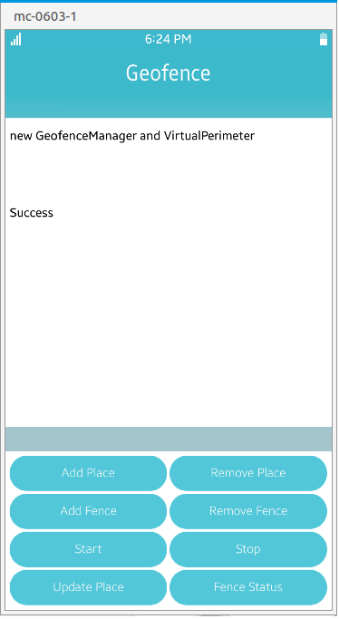

# Geofence

This sample application demonstrates how user can manage geofence.

### Features
* Geofence information of a geographical place.

### Prerequisites

* [Visual Studio](https://www.visualstudio.com/) - Buildtool, IDE
* [Visual Studio Tools for Tizen](https://docs.tizen.org/application/vstools/install) - Visual Studio plugin for Tizen .NET application development

### Precondition

* GPS should be "ON" in the Tizen mobile emulator/ Mobile.
