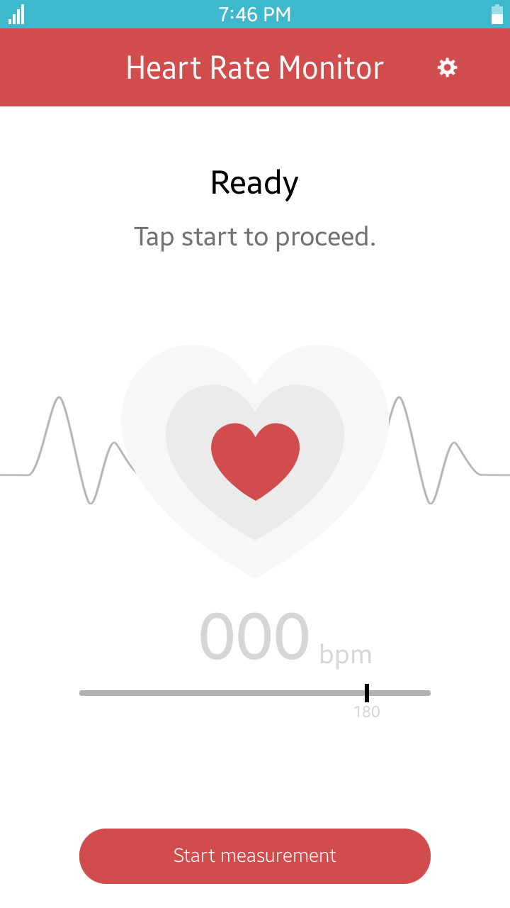
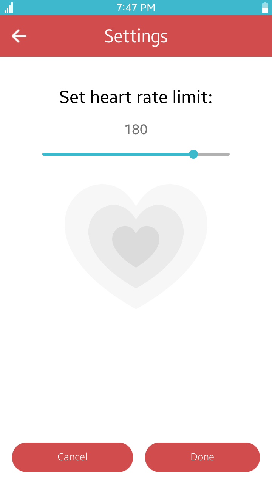

# HeartRateMonitor
HeartRateMonitor is a sample application that demonstrates how to obtain data provided by the HRM sensor (heart rate sensor) using [Tizen Sensor API](https://samsung.github.io/TizenFX/stable/api/Tizen.Sensor.html).

### Features
* Heart rate measurement
* Setting heart rate limit

### Prerequisites
* [Visual Studio](https://www.visualstudio.com/) - Buildtool, IDE
* [Visual Studio Tools for Tizen](https://docs.tizen.org/application/vstools/install) - Visual Studio plugin for Tizen .NET application development

### Author
* Dariusz Paziewski
