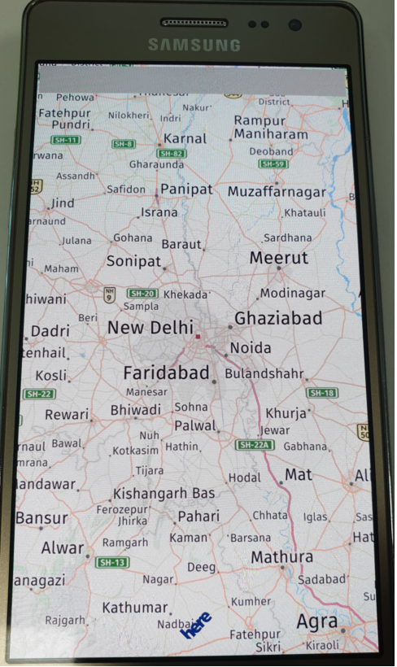

# Maps

This sample application demonstrate how user can use maps service.

### Features
* Maps features(Zoom In,Zoom Out, Scroll, Maps gestures,Rotate).

### Prerequisites

* [Visual Studio](https://www.visualstudio.com/) - Buildtool, IDE
* [Visual Studio Tools for Tizen](https://docs.tizen.org/application/vstools/install) - Visual Studio plugin for Tizen .NET application development

### Precondition

* The Tizen mobile emulator/ Mobile should be connected to internet.
