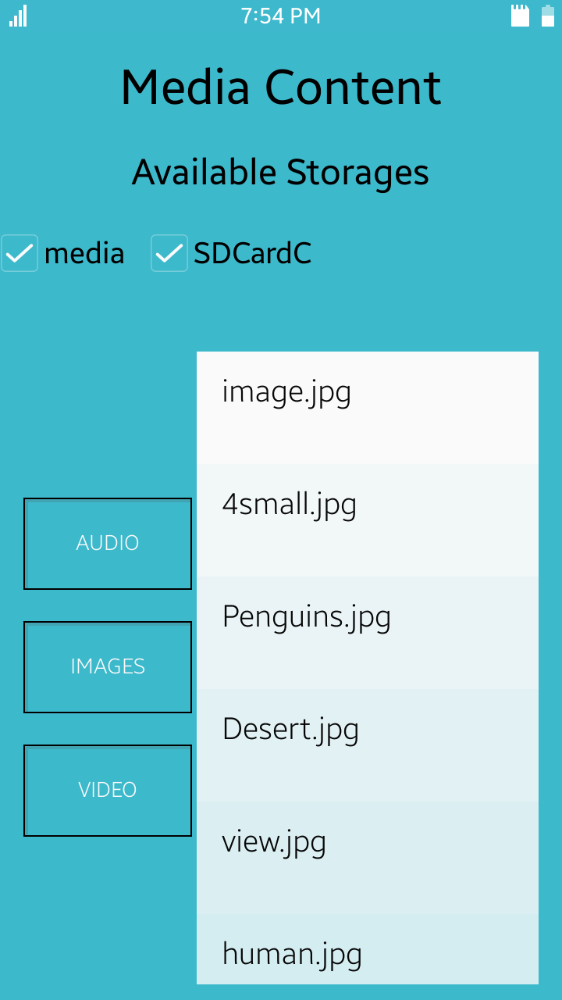
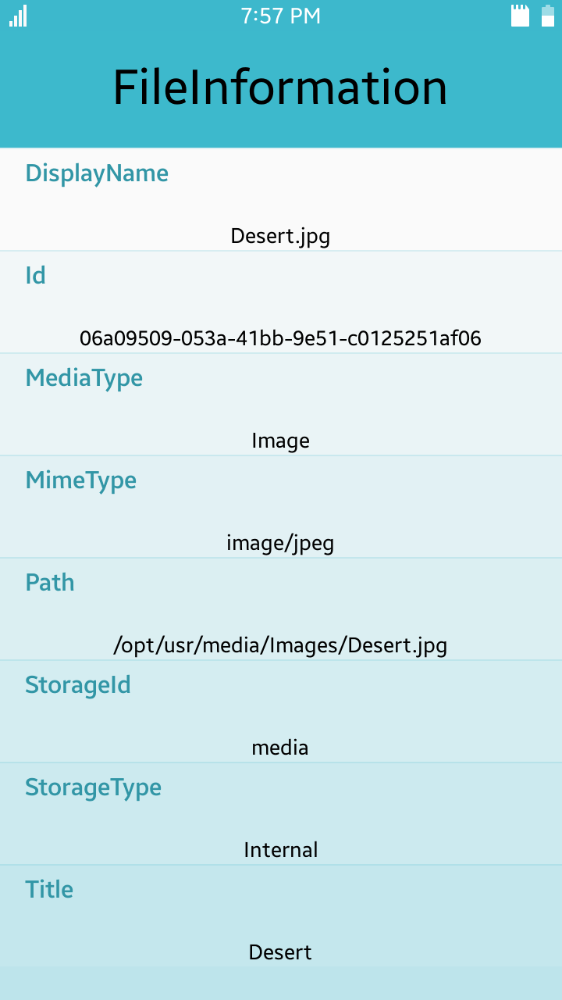

# MediaContent
MediaContent is a sample application which demonstrates how to list media content.

### Features
* Defined list of meida content
* Details page with information about media

### Prerequisites

* [Visual Studio](https://www.visualstudio.com/) - Buildtool, IDE
* [Visual Studio Tools for Tizen](https://docs.tizen.org/application/vstools/install) - Visual Studio plugin for Tizen .NET application development

### Author
* Mateusz Szperna
