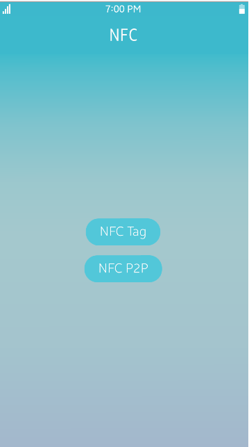
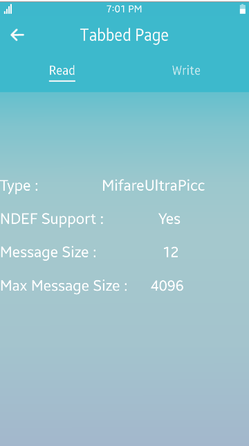
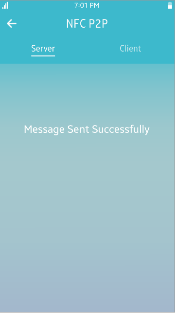

# NFC
The NFC allows you to send a NDEF message to the remote NFC device, and read or write NDEF message to NFC Tag.
NFC sample is mainly designed for Tizen Mobile profile and it is written in [Developer Site](https://docs.tizen.org/application/dotnet/guides/connectivity/nfc).

### Verified Version
* Xamarin.Forms : 4.5.0
* Tizen.NET : 6.0.0
* Tizen.NET.SDK : 1.0.9

### Supported Profile
* Mobile

### Author
* Jihoon Jung
