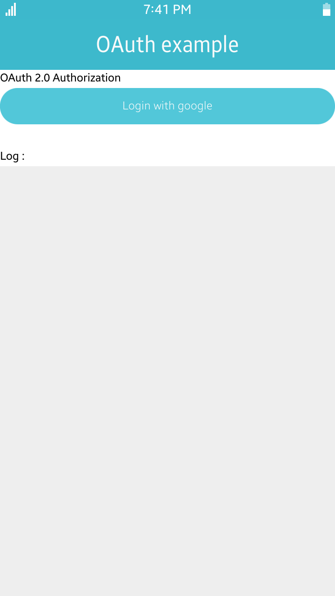
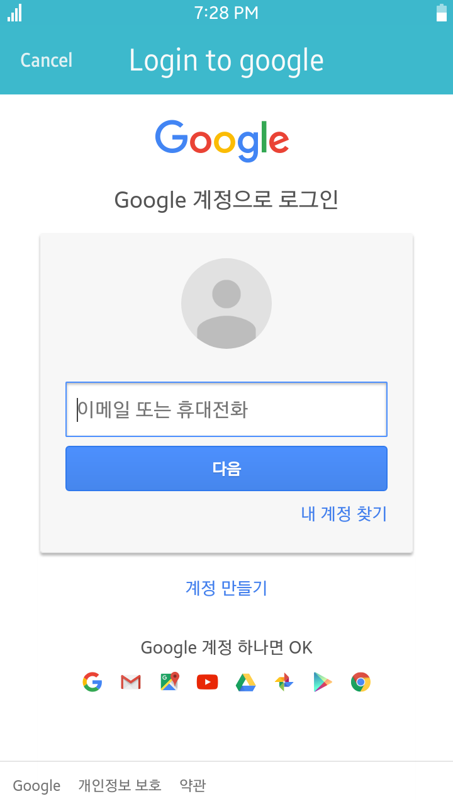
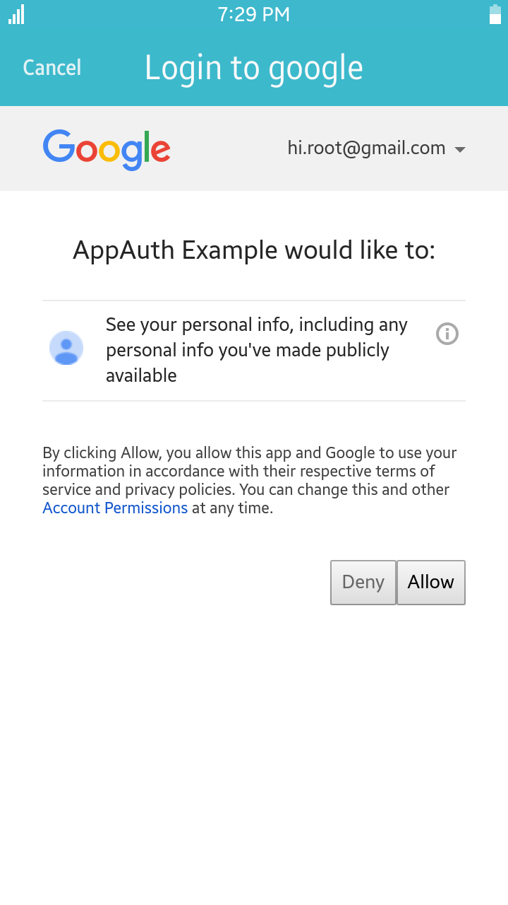
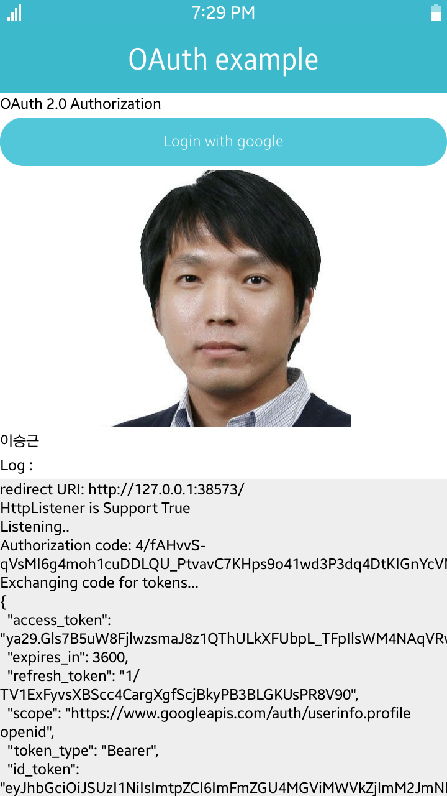

# OAuth 2.0 Example

This application was ported from <a href='https://github.com/googlesamples/oauth-apps-for-windows' target=_blank>googlesamples/oauth-apps-for-windows</a> to work on tizen

Introduction
------------

When doing an OAuth 2.0 Authorization flow to Google in a native application, it
is important to follow 
[best practices](https://tools.ietf.org/html/draft-ietf-oauth-native-apps), 
which require using the browser (and not an embedded browser).

These samples show how to complete an OAuth 2.0 Authorization request in a
traditional app, where a loopback redirect is used to received the code, and in
a universal app where a URI scheme is used for the same.

<table>
<tr>
    <td>

</td>
<td>

</td>
<td>

</td>
<td>

</td>

</tr>
</table>

### Verified Version
* Xamarin.Forms : 4.1.0.555618
* Xamarin.Platform.Tizen : 4.1.0.555618
* Tizen.NET : 4.0.0
* Tizen.NET.SDK : 1.0.0

### Supported Profile
* All

### Author
* Seungkeun Lee
